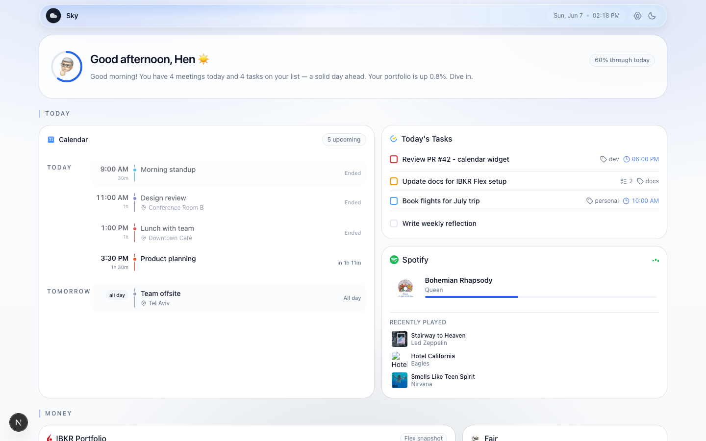
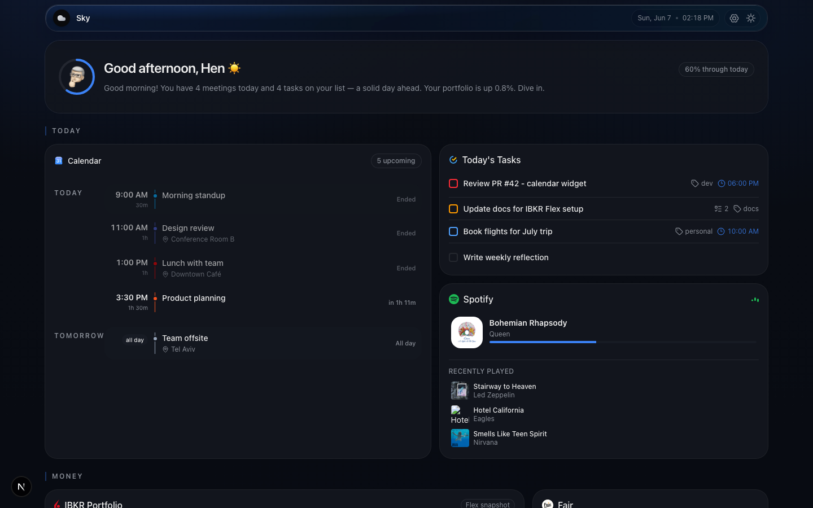
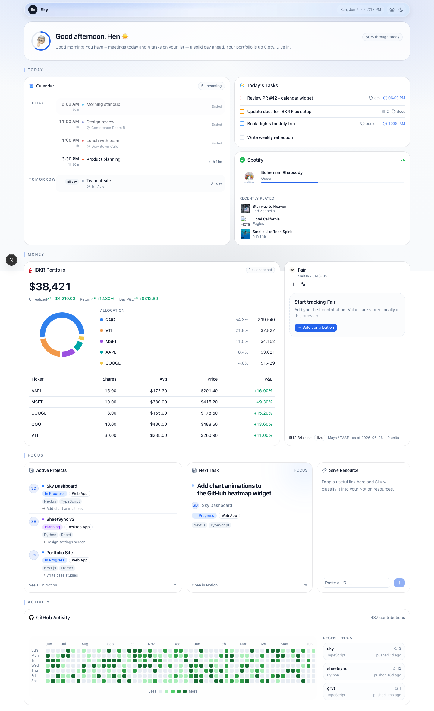
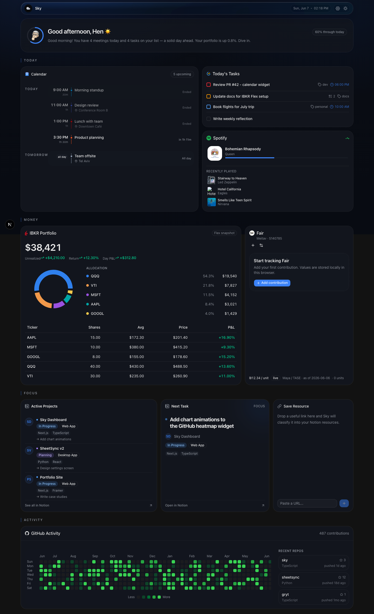

<p align="center">
  
</p>

<h1 align="center"><b>Sky - Sof Kol Yom</b></h1>

<p align="center">A single-user personal dashboard that pulls Google Calendar, Notion, Spotify, GitHub, TickTick, Interactive Brokers, and Israeli mutual funds (Fair / Maya) into one live view.</p>

<p align="center">
  
  
  
  
  
  
</p>

<p align="center">
  <a href="#about">About</a> |
  <a href="#dashboard">Dashboard</a> |
  <a href="#screenshots">Screenshots</a> |
  <a href="#tech-stack">Tech Stack</a> |
  <a href="#getting-started">Getting Started</a> |
  <a href="#connecting-services">Connecting Services</a>
</p>

---

## About

Sky is a personal dashboard that replaces opening six apps every morning to check on the day. It is single-user (no auth, no multi-tenancy) and always live-fetched: there is no database and no cache. Every widget calls its own Next.js API route, which talks to the upstream service on request. Secrets stay in `.env.local` and never reach the client; all external calls go through `app/api/*` route handlers.

Each widget fetches independently with SWR, shows its own skeleton while loading, and falls back to a local error state if its service is not connected, so one missing connector does not break the rest of the page.

## Dashboard

The page is a bento grid where each widget is sized by importance and content shape. It has a time-based greeting, a live clock, and a dark mode.

| Widget                | Data surfaced                                                       | Status        |
| --------------------- | ------------------------------------------------------------------ | ------------- |
| Greeting (Groq AI)    | One-line AI summary of the day                                     | Live          |
| GitHub                | Recent repos and contribution heatmap                             | Live          |
| Notion - Projects     | Active projects from the Portfolio Tracker DB                     | Live          |
| Notion - Next Task    | The most urgent in-progress project                              | Live          |
| Resource Quick-Add    | Paste a URL, Groq classifies it, saved to the Notion Resources DB | Live          |
| Spotify               | Now playing and recently played                                   | Needs OAuth   |
| Google Calendar       | Next 5 events                                                     | Needs OAuth   |
| TickTick              | Today's incomplete tasks                                          | Needs OAuth   |
| Interactive Brokers   | Portfolio value, allocation donut, positions via official Flex snapshots or local IBKR Gateway | Needs setup   |
| Fair (Maya / TASE)    | Israeli mutual fund unit price, personal contributions, and P&L tracker                        | Live (no auth) |

See [`INTEGRATIONS.md`](./INTEGRATIONS.md) for auth setup per service.

## Screenshots

| Light | Dark |
|---|---|
|  |  |

| Full dashboard (light) |
|---|
|  |

| Full dashboard (dark) |
|---|
|  |

## Tech Stack

| Layer             | Technology                                          |
| ----------------- | --------------------------------------------------- |
| Framework         | Next.js (App Router, Turbopack)                     |
| Language          | TypeScript 5 (strict)                               |
| UI library        | React 19                                            |
| Components        | shadcn/ui Nova (Base UI primitives), lucide + react-icons |
| Styling           | Tailwind CSS v4 (CSS-first `@theme` tokens)         |
| Data fetching     | SWR (per-widget, client-side)                       |
| Charts            | Recharts                                            |
| AI                | Groq (`llama-3.1-8b-instant`, `llama-3.3-70b`)      |
| Linter            | ESLint 9 (`eslint-config-next`)                     |
| Brokerage data    | Official IBKR Flex Web Service + optional Client Portal Gateway |
| Deployment        | Vercel                                              |

No database. No background jobs. Data is fetched on demand by the API routes.

## Getting Started

### Prerequisites

- Node.js 20+
- API credentials for whichever services you want to enable (see [Connecting Services](#connecting-services))

### 1. Install

```bash
npm install
```

### 2. Configure environment

```bash
cp .env.local.example .env.local
```

Fill in the credentials for the services you want. `.env.local` is gitignored. GitHub, Notion, and Groq only need their token or key; the OAuth services need a one-time flow (below).

### 3. Run

```bash
npm run dev      # dev server at http://localhost:3000
npm run build    # production build
npm run lint     # eslint
```

The shell renders right away. Each widget loads its own data, and any service you have not connected shows its error state without affecting the others.

## Connecting Services

Full details are in [`docs/integrations.md`](./docs/integrations.md). Quick reference:

- **GitHub**: set `GITHUB_PAT` and `GITHUB_USERNAME`. Works immediately.
- **Notion**: create an integration, share the Portfolio Tracker and Resources databases with it (DB, then ... menu, then Connections), then set `NOTION_TOKEN` and the two DB IDs.
- **Groq**: set `GROQ_API_KEY` (free tier at console.groq.com).
- **Spotify, Google Calendar, TickTick**: run the one-time OAuth helper from the project root to get a refresh token:

  ```bash
  node scripts/get-spotify-token.mjs
  node scripts/get-google-token.mjs
  node scripts/get-ticktick-token.mjs
  ```

  Each one prints the redirect URI to register and the line to paste into `.env.local`. See [`scripts/README.md`](./scripts/README.md).
- **Interactive Brokers**: for persistent read-only portfolio snapshots, enable IBKR Flex Web Service, create an Activity Flex Query with Open Positions and Net Asset Value, then set `IBKR_DATA_SOURCE=flex`, `IBKR_FLEX_TOKEN`, and `IBKR_FLEX_QUERY_ID`. For live gateway data, run `npm run ibkr:setup`, `npm run ibkr:start`, then log in at `https://localhost:5001`.

## Desktop app

Sky is also packaged as a desktop app (Electron) for macOS and Windows. Build locally with `npm run electron:build` (output in `release/`), or grab a build from CI via `workflow_dispatch` or a `v*` tag release. See [`docs/desktop.md`](./docs/desktop.md) for setup, config location, logs, and install notes (Gatekeeper / SmartScreen).

## License

Unlicensed, private personal project.
